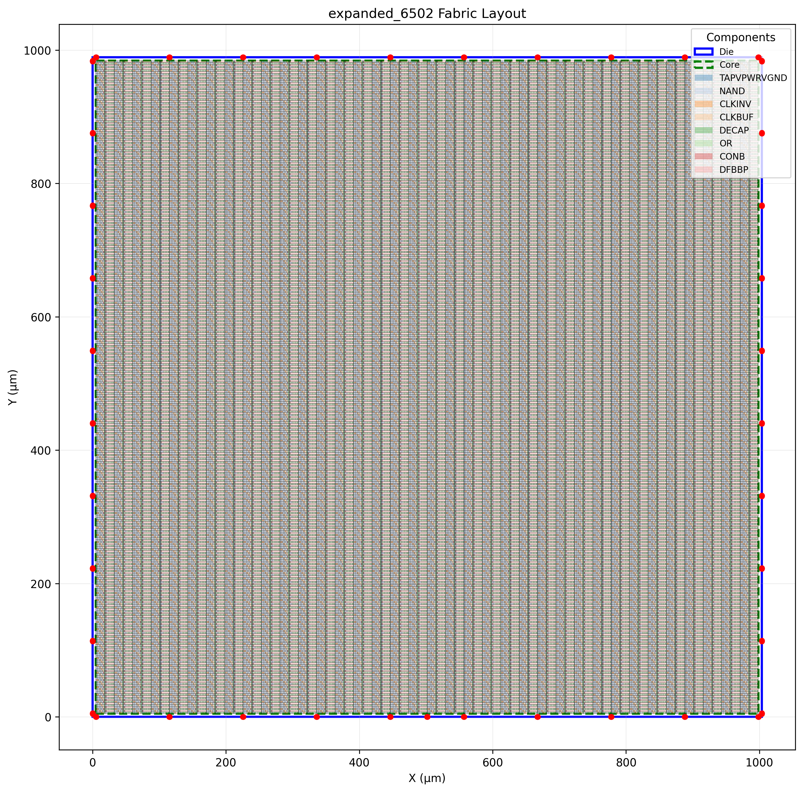
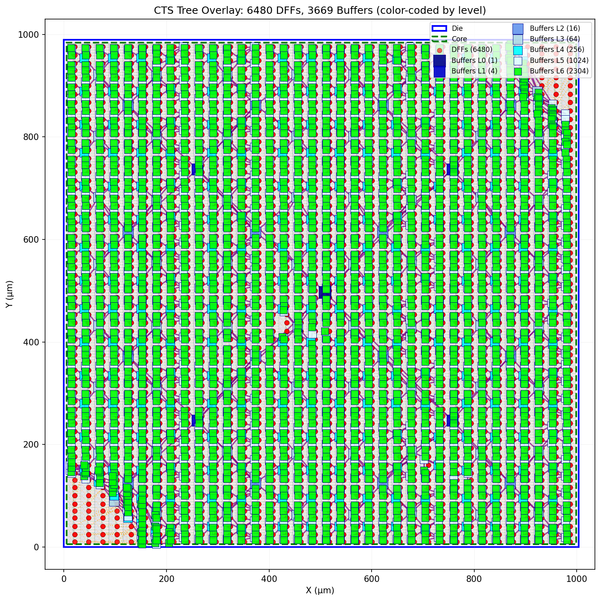
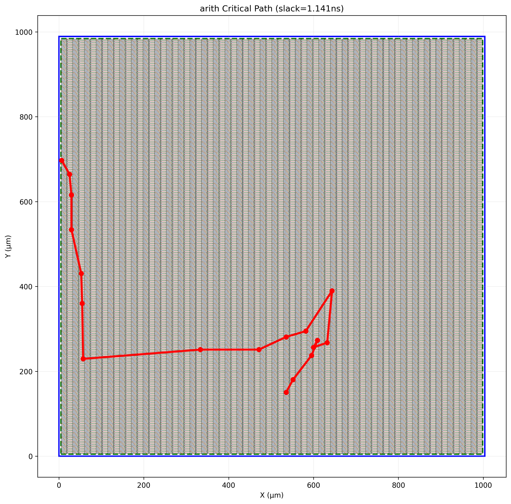

# Structured-ASIC

A complete Place-and-Route (PnR) and Static Timing Analysis (STA) flow for a structured ASIC platform using the SKY130 PDK.

## Project Overview

This project implements a physical design flow for a pre-fabricated structured ASIC fabric. Unlike standard-cell ASIC where placement determines cell coordinates, structured ASIC "placement" is an **assignment problem**: mapping logical cells to fixed physical fabric slots.

### Flow Stages
1. **Phase 1:** Fabric parsing, design validation, visualization
2. **Phase 2:** Placement (Greedy + Simulated Annealing)
3. **Phase 3:** Clock Tree Synthesis (H-Tree) + ECO netlist generation
4. **Phase 4:** DEF generation + OpenROAD routing
5. **Phase 5:** Static Timing Analysis (OpenSTA)

---

## Results Dashboard

### Design Comparison

| Design | Cells | Util % | Placer | WNS (ns) | TNS (ns) | DRC | Status |
|--------|-------|--------|--------|----------|----------|-----|--------|
| arith | 463 | 0.3% | Greedy+SA | +1.14 ✅ | 0.00 ✅ | 0 ✅ | **PASS** |
| 6502 | 2,899 | 1.8% | Greedy+SA | +2.47 ✅ | 0.00 ✅ | 0 ✅ | **PASS** |
| expanded_6502 | 2,899 | 1.8% | Greedy+SA | +2.47 ✅ | 0.00 ✅ | 0 ✅ | **PASS** |
| z80 | 9,144 | 5.8% | Greedy+SA | — | — | — | Placed |

**Fabric Size:** 158,760 cells

### CTS Statistics

| Design | CTS Buffers | Tree Depth | DFF Sinks | Clock Skew |
|--------|-------------|------------|-----------|------------|
| arith | 3,669 | 6 | 6,480 | 0.27 ns |
| 6502 | 3,669 | 6 | 6,480 | 0.28 ns |
| expanded_6502 | 3,669 | 6 | 6,480 | 0.28 ns |
| z80 | 3,669 | 6 | 6,480 | — |

### Power Analysis

| Design | Sequential | Combinational | Clock | Total |
|--------|------------|---------------|-------|-------|
| arith | 0.14 mW | 0.16 mW | 18.2 mW | **18.5 mW** |
| 6502 | 1.01 mW | 4.46 mW | 18.3 mW | **23.8 mW** |
| expanded_6502 | 1.01 mW | 4.46 mW | 18.3 mW | **23.8 mW** |

---

## Analysis

### Timing Closure
All tested designs achieve **timing closure** with positive worst negative slack (WNS > 0). This indicates:
- Clock period of 10 ns (100 MHz) is achievable
- H-Tree CTS provides balanced clock distribution (skew < 0.3 ns)
- Placement quality from SA optimization enables short timing paths

### Utilization Scaling
- Low-utilization designs (arith, 6502, expanded_6502) route cleanly with **zero DRC violations**
- z80 (5.8% utilization) demonstrates scaling to larger designs
- The fabric has ample routing resources for designs at low utilization

### Clock Network Dominance
Power analysis shows clock network consumes 77-98% of total power. This is expected because:
- H-Tree uses 3,669 buffers driving 6,480 DFF sinks
- All fabric DFF slots receive clock signal (power-down ECO mitigates unused cells)

---

## Final Layout



*Routed layout of expanded_6502 design showing placed cells and I/O pins*

---

## SA Knob Exploration (Task 1.D)

To evaluate how simulated annealing parameters affect placement quality and runtime, a structured two-phase sweep was performed using the **6502** design.

---

### Phase 1 – Sweeping Cooling Rate (α) and Moves per Temperature (N)

In the first sweep, we varied the main cost–runtime control parameters:

- **Cooling Rate (α):** {0.85, 0.92, 0.97}  
- **Moves per Temperature (N):** {100, 200, 400}  
- **Initial Temperature (T₀):** 50.0 (held constant)  
- **Refine Probability (P_refine):** 0.7 (held constant)

Each configuration was run **three times with different random seeds**, starting from the same greedy initial placement. The resulting plot (`sa_knob_analysis.png`) shows:

- **Runtime (s)** on the X-axis  
- **Final HPWL (µm)** on the Y-axis  
- Pareto frontier highlighted

#### Observations

- The frontier was smooth, with **no single dramatic “knee”**, suggesting:
  - Increasing annealing effort (higher N or α) steadily improves HPWL  
  - But also increases runtime proportionally  
- **Fastest configuration:**  
  - α = 0.85, N = 100  
  - Runtime ≈ 100–110 s  
  - HPWL ≈ 427k µm  
  - Good for debugging / early development
- **Best HPWL observed:**  
  - α = 0.97, N = 400  
  - HPWL ≈ 214k–217k µm  
  - Runtime ≈ 2,000–4,000 s  
  - Best solution quality, highest effort
- **Best balance (used for Phase 2):**
  - α = 0.92, N = 200  
  - Strong improvement over fast settings  
  - Runtime manageable (few hundred seconds)

Based on this, **α = 0.92 and N = 200** were selected as the baseline for the second stage of testing.

---

### Phase 2 – Sweeping Initial Temperature (T₀) and Move Selection Bias

With α and N fixed, the second sweep explored search-dynamics parameters:

- **Initial Temperature (T₀):** {25, 50, 100, 200}  
- **Refine Probability (P_refine):** {0.25, 0.50, 0.70, 0.85}  
  - (**P_explore = 1 – P_refine**)  

Again, each configuration was run three times with independent random seeds.

#### Observations

- **Higher initial temperature (T₀)** improves early global exploration.
- **Balanced refine/explore ratios (P_refine ≈ 0.5)** give strong results without excessive runtime.
- **Very high refine probabilities (≥0.85)** converge quickly but risk getting trapped early.
- **Very low refine probabilities (≤0.25)** explore widely but are slower.

---

### Final Recommended Default SA Settings

From both sweeps, the following configuration provides the **best tradeoff between runtime and placement quality**:

Initial Temperature (T₀) = 100
Cooling Rate (α) = 0.92
Moves per Temp (N) = 200
Refine Probability = 0.50


This setting:

- Produces solutions near the Pareto frontier  
- Runs comfortably within reasonable time budgets  
- Is recommended as the standard configuration for normal Structured-ASIC placement

---

### Useful Operating Modes

| Mode | α | N | T₀ | P_refine | Runtime | HPWL | Notes |
|---|---|---|---|---|---|---|---|
| Fast (debug) | 0.85 | 100 | 50 | 0.7 | ~100 s | ~427k | Quick runtime, weakest QoR |
| **Recommended** | **0.92** | **200** | **100** | **0.5** | Few hundred s | ~300–340k | Strong QoR, reasonable runtime |
| Maximum QoR | 0.97 | 400 | 200 | 0.25 | 2,000–4,000 s | ~215k | Best quality, longest runtime |

---

### Overall Conclusion

Across all experiments, annealing effort scales smoothly with solution quality, and no single sharp “knee” dominates the frontier. However, **α = 0.92, N = 200, T₀ = 100, and P_refine = 0.50** consistently offer the best balance of placement quality and runtime, making them the recommended default SA configuration for this flow.

## Phase 3 — ECO, CTS and Verilog netlist generation

Recent work focused on completing the Phase‑3 ECO flow and ensuring the final Verilog netlist uses the fabric placement names so the netlist can be used directly against the physical fabric.

- Added a renaming utility: `tools/rename_verilog_cells.py` — maps logical instance names to fabric cell names using the placement `.map` file.
- Integrated the renamer into the end-to-end generator: `eco_generator.py` now runs the renamer after producing `build/<design>/<design>_final.v` so the file contains fabric names by default.
- Improved CTS visualization and robustness: `visualization/cts_overlay.py` now falls back to fabric DB and clock-tree coordinates if a placement entry is missing; the CTS overlay is written to `build/<design>/<design>_cts_tree.png`.
- Added a simple validator script (`tools/validate_cts_scale.py`) to check placement and CTS coordinates against die bounds (units in µm).
- Organized scripts: analysis helpers moved to `scripts/analysis/` and visualization helpers consolidated under `visualization/`.

Build outputs (examples):
- `build/<design>/<design>_final.v` — final Verilog netlist (fabric‑named instances)
- `build/<design>/<design>_cts_tree.png` — CTS overlay visualization
- `build/<design>/eco_report.txt` — ECO summary report

Next recommended steps:
- Keep the renamer integrated in the ECO flow (already applied). Optionally add a small CI check that verifies no logical placement keys remain in the final `.v`.
- If you want to retain old experiment outputs, consider archiving `build/experiments/` before removing; otherwise the repo now only keeps the production `build/<design>/` outputs.
---

## Phase 4 & 5 — Routing and STA

### DEF Generation (`make_def.py`)
Generates a fixed DEF file containing:
- `DIEAREA` from fabric specification
- All 158,760 fabric cells as `+ FIXED` components
- I/O pins placed on die boundary

### Routing (`route.tcl`)
OpenROAD-based routing flow:
- 5-layer metal stack (met1 → met5)
- Global routing with congestion handling
- Detailed routing with DRC checking
- SPEF parasitic extraction

### Static Timing Analysis (`sta.tcl`)
OpenSTA-based timing flow:
- Setup and hold timing analysis (top 100 paths)
- Clock skew reporting
- WNS/TNS calculation
- Power analysis

---

## Visualizations

The visualization pipeline generates the following outputs for each design:

| Visualization | Description | Status |
|---------------|-------------|--------|
| `*_layout.png` | Chip layout with placed cells and pins | ✅ |
| `*_density.png` | Placement density heatmap | ✅ |
| `*_net_length.png` | Net length histogram | ✅ |
| `*_cts_tree.png` | CTS H-Tree overlay on layout | ✅ |
| `*_slack.png` | Slack distribution histogram | ✅ |
| `*_critical_path.png` | Critical path overlay on layout | ✅ |
| `*_congestion.png` | Congestion heatmap | ❌ (see limitations) |

### Example Visualizations

#### CTS Tree


#### Slack Histogram


#### Critical Path


---

## Known Limitations

| Issue | Root Cause | Impact |
|-------|------------|--------|
| Congestion heatmap unavailable | OpenROAD `grt::get_congestion_grid` API not exposed | Cannot visualize routing congestion |
| SDC files incomplete | Only `arith.sdc` written | STA for other designs requires SDC creation |
| Scripts hardcoded | Design name not parameterized via env vars | Manual script editing per design |

---

## Usage

### Run Full Flow for a Design
```bash
# Placement
python3 placer.py --design arith

# ECO + CTS
python3 eco_generator.py arith

# DEF Generation
python3 make_def.py arith

# Routing (requires OpenROAD)
openroad route.tcl

# STA (requires OpenSTA)
sta sta.tcl

# Visualizations
python3 visualize.py --design arith
```

### Generated Outputs
All outputs are placed in `build/<design>/`:
- `*.map` — Placement mapping
- `*_final.v` — ECO'd Verilog netlist
- `*_fixed.def` — Fixed DEF for routing
- `*_routed.def` — Routed DEF
- `*.spef` — Parasitic extraction
- `*_setup_timing.rpt` — Setup timing report
- `*.png` — Visualizations

---

## Repository Structure

```
├── placer.py              # Greedy + SA placement
├── eco_generator.py       # CTS + ECO flow
├── cts_htree.py           # H-Tree CTS algorithm
├── make_def.py            # DEF generation
├── route.tcl              # OpenROAD routing script
├── sta.tcl                # OpenSTA timing script
├── visualize.py           # Visualization CLI
├── validator.py           # Design validation
├── designs/               # Input design JSONs
├── fabric/                # Fabric specification files
├── tech/                  # SKY130 LEF/Liberty files
├── build/                 # Generated outputs per design
└── visualization/         # Visualization package
```

---

## Team

[Team member names]

## License

[License information]